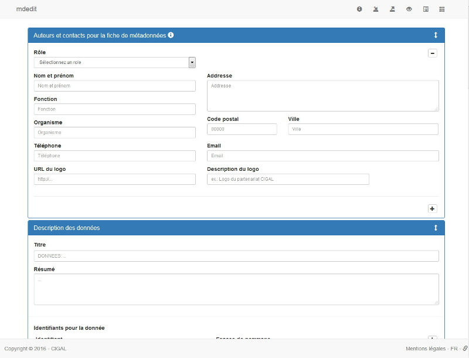
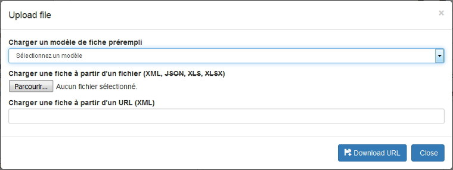
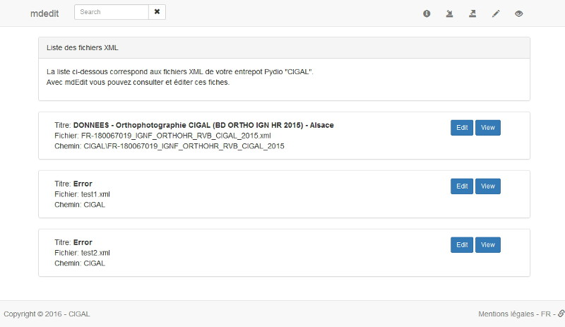

# mdedit - Documentation utilisateur (v.160917)

mdEdit est un outil simple et ouvert de saisie, modification et consultation de fiches de métadonnées conformes au format ISO 19139 / INSPIRE et recommandations associées.

Cette application se veut facile d'usage. La présente documentation constitue un simple guide de prise en main.

## Fonctionnalités principales

mdEdit permet :

-   La création de fiches de métadonnées ISO/INSPIRE
-   La modification de fiches de métadonnées ISO/INSPIRE
-   La visualisation/consultation de fiches de métadonnées ISO/INSPIRE
-   L'import de fichiers au format XML ISO/Inspire
-   L'export de fichiers au format XML ISO/Inspire

**NB**: l'application mdEdit ne propose pas d'espace de stockage. Les fichiers vers lesquels pointe la fiche de métadonnées (miniature, documentation, données, etc.) doivent être stockés sur un serveur public pour ensuite être accessible facilement.
Pour les partenaires CIGAL, un espace de stockage "Pydio" peut être mis à disposition sur la plateforme https://www.cigalsace.org.

## Se connecter à mdEdit

mdEdit ne nécessite pas d'authentification pour fonctionner. Il vous suffit de vous rendre à l'adresse https://www.cigalsace.org/tools/mdedit pour accéder à l'application et commencer à décrire vos données.

**NB**: Les personnes authentifiées sur la Géoplateforme CIGAL ont cependant la possibilité d'éditer et d'exporter les fichiers XML directement dans leur espace Pydio.

## Accueil de l'application

**Notions importantes:**

-   Vue ou modèle de formulaire: elle correspond au masque de saisie à renseigner pour décrire les données ou carte.
-   Modèle de fiche: il correspond aux données qui sont chargées dans le formulaire et qui permet de le pré-remplir pour faciliter la saisie.

mdEdit s'ouvre sur la page d'accueil.
Pour commencer à saisir une fiche, vous devez choisir une vue ou modèle de formulaire parmi ceux proposés dans la liste à droite de l'écran. Chaque formulaire de saisi comporte des spécificités notamment en terme d'ergonomie. Un modèle est généralement chargé par défaut (ensemble de champs pré-remplis).

## Saisir une fiche de métadonnées

Une fois le formulaire de saisie sélectionné, vous pouvez commencer à décrire vos données et remplir le formulaire proposé.
Si le modèle préchargé ne correspond pas à vos attentes, vous avez la possibilité de la changer ou de charger un modèle "vide" (cf. Importer une fiche de métadonnées).

L'interface propose les fonctionnalités suivantes:

-   Consultation de la documentation de chaque champ. Un clic sur l'intitulé du champ permet d'accéder directement à la documentation de ce champ.
    <!-- - Affichage en vue "Consultation" via le bouton  -->
-   Changer de vue. le changement de vue n'efface pas le formulaire en cours de saisie.
-   Masquage des ensembles de champs. Pour cela, cliquez sur le bouton 
    <!-- - Affichage de champs supplémentaires. Le bouton  permet d'afficher des champs plus techniques ou généralement auto-générés par l'application (identifiant de la fiche, encodage des caratères, etc.). -->
-   Gestion des champs multiples. Certains champs, comme les contacts peuvent être multiples. Utilisez les boutons  et  pour ajouter ou supprimer une valeur.
-   Consultation de l'aide
-   Retour à la page d'accueil. Attention, le retour à la page d'accueil efface le formulaire en cours.

<!--
**NB**: les utilisateur authentifiés sur la Géoplateforme CIGAL disposent d'un bouton supplémentaire  leur permettant de lister et d'éditer les fichiers de leur espace Pydio. L'utilisateur doit être administrateur de son catalogue.
-->

## Visualiser/consulter une fiche de métadonnées

<!-- Le bouton  permet de basculer en vue "consultation". La fiche est alors réorganisée selon une présentation plus adaptée à la lecture.
Pour revenir à la vue "édition", utilisez le bouton . -->

Une vue spécifique a été développée pour permettre la consultation de fiches de métadonnées.
Elle ne permet par l'édition des fiches.

## Importer une fiche de métadonnées

Pour importer une fiche de métadonnées, cliquez sur le bouton .

La fenêtre offre plusieurs possibilités d'import:

Ces possibilités sont:

-   Import à partir d'un modèle prédéfini proposé directement par mdEdit
-   Import d'un fichier XML local. Cette opération peut se faire par un simple glisser/déposer sur le bouton "parcourir".
-   Import d'un fichier XML distant. Pour cela, renseigner l'URL du fichier avant de valider. Cette fonctionnalité permet d'utiliser un fichier existant pour l'adapter ou le mettre à jour.

**Astuce**: Grâce à cette troisième possibilité, les parenaires CIGAL peuvent charger un fichier XML à partir de leur espace Pydio et ensuite le mettre à jour après l'avoir sauvegardé.

## Exporter une fiche de métadonnées

Pour exporter une fiche au format XML, cliquez sur le bouton .
La fenêtre qui s'ouvre vous permet de visualiser le résultat de la conversion.

Le bouton "Download file" permet soit:

-   D'enregistrer le fichier XML sur votre ordinateur. Le nom du fichier généré correspond à l'identifiant de la fiche.
-   D'exporter le fichier XML dans votre espace Pydio. Cela nécessite à l'utilisateur d'être authentifié sur la Géoplateforme CIGAL.

**NB**: Pour les utilisateurs authentifié, le fichier est exporté dans _metdata/ORG/filename/filename.xml_ ou ORG est le nom/sigle de l'organisme et filename le nom du fichier. Cela impose d'utiliser l'identifiant de la fiche de métadonnées comme nom de fichier et de respecter l'arborescence ci-dessus.

## Changer la langue de l'interface

Le bouton  en bas à droite de l'écran propose une liste des langues disponibles pour l'interface. Il vous suffit de choisir celle qui vous convient.

<!--
## Obtenir un permalien

Le bouton  en bas à droite de l'écran permet d'obtenir un permalien.
Le permalien permet de préciser:

- le model
- la vue
- un fichier XML si précisé dans l'URL
- la langue
-->

<!--
## Création et mise à jour d'une fiche de l'espace Pydio (utilisateurs authentifiés)

Comme indiqué précédemment, les utilisateurs authentifiés de la Géoplateforme CIGAL peuvent:

- Lister les fichiers XML de leur espace Pydio (bouton )
- Editer les fichiers XMl de leur espace Pydio
- Téléverser les nouvelles fiches sur leur espace Pydio

-->
